# Modelo de datos Alo Vecino

Modelo propuesto para el dominio actual de usuarios, auth, almacenes, consultas, valoraciones y ofertas. Cada `ALMACEN` representa un local fisico independiente; si un administrador tiene varios locales, se registran como varios almacenes asociados al mismo `USUARIO`.

```mermaid
erDiagram
    ROL ||--o{ USUARIO : asigna
    USUARIO ||--o| CLIENTE : perfil_cliente
    USUARIO ||--o{ ALMACEN : administra
    USUARIO ||--o| CONFIGURACION_USUARIO : configura
    USUARIO ||--o{ SESION_USUARIO : inicia
    SESION_USUARIO ||--o{ REFRESH_TOKEN : rota

    ESTADO_CUENTA ||--o{ CLIENTE : clasifica
    ESTADO_CUENTA ||--o{ ALMACEN : clasifica

    REGION ||--o{ COMUNA : contiene
    COMUNA ||--o{ DIRECCION : ubica

    DIRECCION ||--o{ CLIENTE : ubica
    DIRECCION ||--o{ ALMACEN : ubica

    ALMACEN ||--o{ ALMACEN_CONTACTO : tiene
    TIPO_CONTACTO ||--o{ ALMACEN_CONTACTO : clasifica

    ALMACEN ||--o{ ALMACEN_CATEGORIA : clasifica
    CATEGORIA_ALMACEN ||--o{ ALMACEN_CATEGORIA : pertenece

    ALMACEN ||--o{ ALMACEN_HORARIO : atiende
    ALMACEN ||--o{ ALMACEN_IMAGEN : muestra
    TIPO_IMAGEN ||--o{ ALMACEN_IMAGEN : clasifica

    ESTADO_CONSULTA ||--o{ CONSULTA : clasifica
    CLIENTE ||--o{ CONSULTA : realiza
    ALMACEN ||--o{ CONSULTA : recibe
    CONSULTA ||--o{ CONSULTA_DETALLE : contiene

    CLIENTE ||--o{ VALORACION : escribe
    ALMACEN ||--o{ VALORACION : recibe

    ALMACEN ||--o{ OFERTA : publica
    OFERTA ||--o{ OFERTA_CATEGORIA : clasifica
    CATEGORIA_ALMACEN ||--o{ OFERTA_CATEGORIA : apunta

    CLIENTE ||--o{ CLIENTE_CATEGORIA_INTERES : prefiere
    CATEGORIA_ALMACEN ||--o{ CLIENTE_CATEGORIA_INTERES : interesa

    ROL {
        bigint id_rol PK
        string nombre_rol UK
    }

    USUARIO {
        bigint id_usuario PK
        string rut UK
        string nombre_usuario UK
        string nombre
        string correo UK
        string contrasena
        bigint id_rol FK
        datetime fecha_creacion
        datetime fecha_actualizacion
    }

    SESION_USUARIO {
        bigint id_sesion_usuario PK
        bigint id_usuario FK
        string dispositivo
        string user_agent
        string ip_origen
        datetime fecha_login
        datetime fecha_ultimo_uso
        datetime revoked_at
    }

    REFRESH_TOKEN {
        bigint id_refresh_token PK
        bigint id_sesion_usuario FK
        string hash_token UK
        datetime fecha_creacion
        datetime fecha_expiracion
        datetime fecha_revocacion
    }

    CONFIGURACION_USUARIO {
        bigint id_configuracion_usuario PK
        bigint id_usuario FK
        boolean notificaciones_push
        boolean notificaciones_email
        boolean recibir_ofertas
        boolean perfil_visible
        decimal radio_ofertas_km
        datetime fecha_creacion
        datetime fecha_actualizacion
    }

    CLIENTE {
        bigint id_cliente PK
        date fecha_nacimiento
        bigint id_usuario FK
        bigint id_direccion FK
        bigint id_estado_cuenta FK
        datetime fecha_creacion
        datetime fecha_actualizacion
    }

    ALMACEN {
        bigint id_almacen PK
        string nombre
        bigint id_usuario FK
        bigint id_direccion FK
        bigint id_estado_cuenta FK
        datetime fecha_creacion
        datetime fecha_actualizacion
    }

    DIRECCION {
        bigint id_direccion PK
        string calle
        string numero
        string codigo_postal
        decimal latitud
        decimal longitud
        bigint id_comuna FK
    }

    REGION {
        bigint id_region PK
        string nombre UK
        string codigo UK
    }

    COMUNA {
        bigint id_comuna PK
        string nombre
        bigint id_region FK
    }

    ESTADO_CUENTA {
        bigint id_estado_cuenta PK
        string codigo UK
        string nombre
        string descripcion
    }

    ALMACEN_CONTACTO {
        bigint id_almacen_contacto PK
        bigint id_almacen FK
        bigint id_tipo_contacto FK
        string valor
        string nombre_contacto
        boolean es_principal
    }

    TIPO_CONTACTO {
        bigint id_tipo_contacto PK
        string codigo UK
        string nombre
    }

    CATEGORIA_ALMACEN {
        bigint id_categoria_almacen PK
        string nombre UK
        string descripcion
    }

    ALMACEN_CATEGORIA {
        bigint id_almacen_categoria PK
        bigint id_almacen FK
        bigint id_categoria_almacen FK
    }

    ALMACEN_HORARIO {
        bigint id_almacen_horario PK
        bigint id_almacen FK
        smallint dia_semana
        time hora_apertura
        time hora_cierre
        boolean cerrado
    }

    ALMACEN_IMAGEN {
        bigint id_almacen_imagen PK
        bigint id_almacen FK
        bigint id_tipo_imagen FK
        string url
        int orden
    }

    TIPO_IMAGEN {
        bigint id_tipo_imagen PK
        string codigo UK
        string nombre
    }

    ESTADO_CONSULTA {
        bigint id_estado_consulta PK
        string codigo UK
        string nombre
        string descripcion
    }

    CONSULTA {
        bigint id_consulta PK
        bigint id_cliente FK
        bigint id_almacen FK
        bigint id_estado_consulta FK
        string respuesta
        datetime fecha_respuesta
        datetime fecha_creacion
        datetime fecha_actualizacion
    }

    CONSULTA_DETALLE {
        bigint id_consulta_detalle PK
        bigint id_consulta FK
        string descripcion
        int cantidad_solicitada
    }

    VALORACION {
        bigint id_valoracion PK
        int cantidad_estrellas
        string contenido
        bigint id_cliente FK
        bigint id_almacen FK
        datetime fecha_creacion
        datetime fecha_actualizacion
    }

    OFERTA {
        bigint id_oferta PK
        bigint id_almacen FK
        string titulo
        string descripcion
        decimal radio_km
        datetime fecha_inicio
        datetime fecha_fin
        boolean activa
        datetime fecha_creacion
        datetime fecha_actualizacion
    }

    OFERTA_CATEGORIA {
        bigint id_oferta_categoria PK
        bigint id_oferta FK
        bigint id_categoria_almacen FK
    }

    CLIENTE_CATEGORIA_INTERES {
        bigint id_cliente_categoria_interes PK
        bigint id_cliente FK
        bigint id_categoria_almacen FK
    }
```

